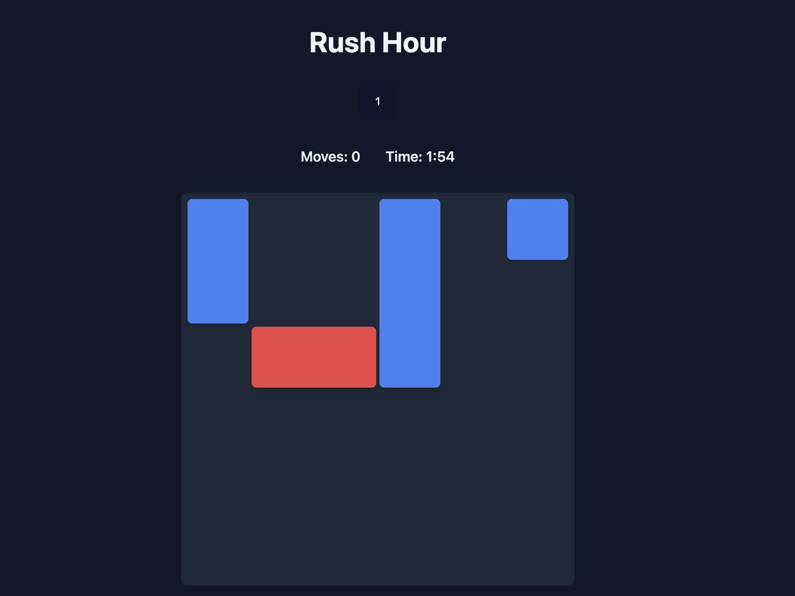
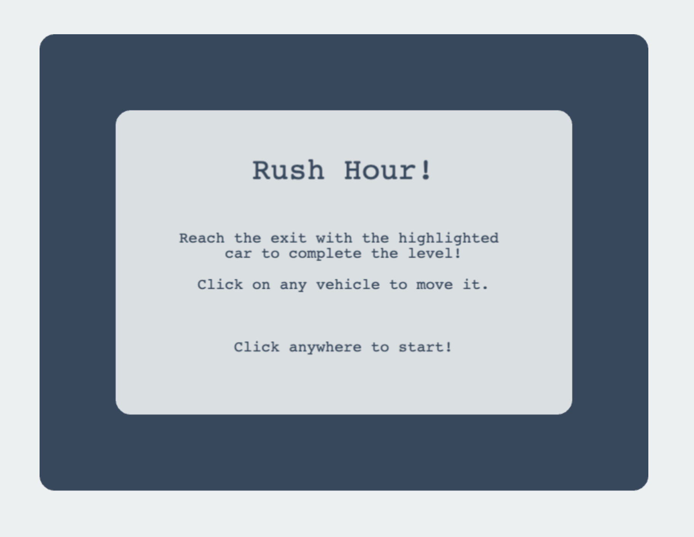
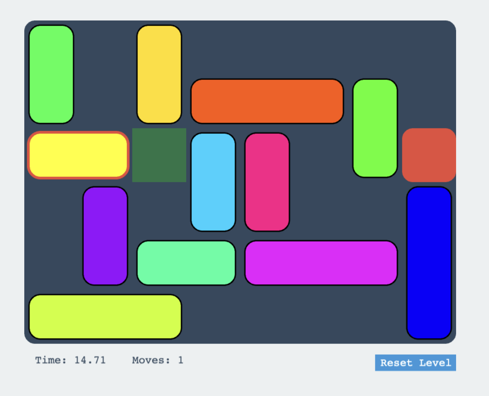
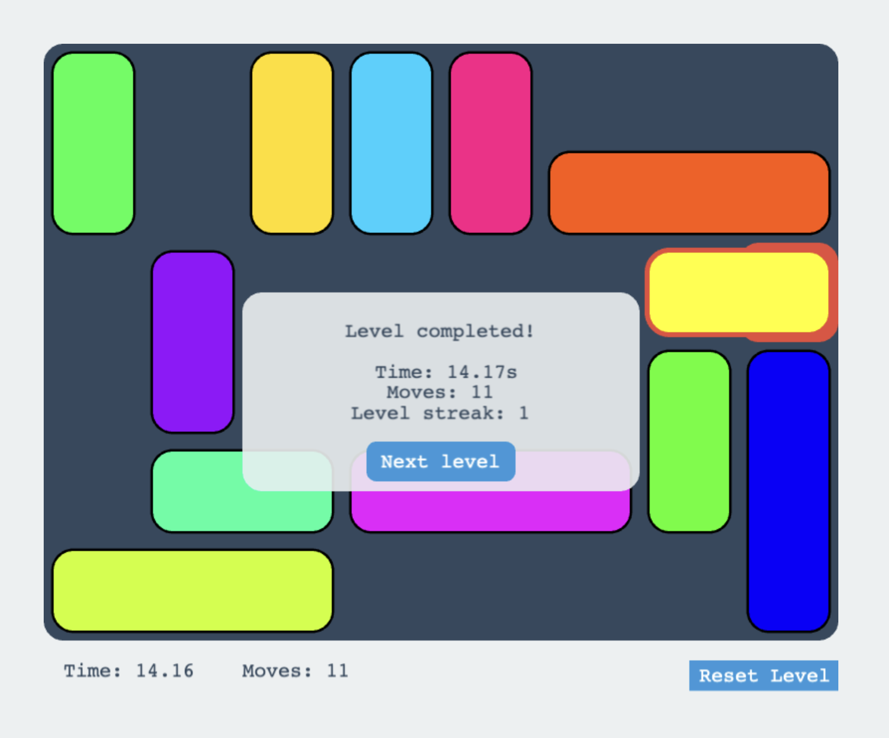

# Creación del prompt inicial

**Herramienta usada: ChatGPT 4o**

1. I want to create a web game based on the Rush Hour game. Help me generate a prompt that can be used to create the game

2. Let's make the game more simple. The game will only have one screen, which will already contain the level to be played. The screen will also contain score tracking based on how fast the player completed levels, a counter for how many levels in a row the user was able to complete, and a "Give up" button that gives the player a new level but resets all progress and score.

3. It is very important that game levels are possible to be finished. Make sure to include tests to check that both that and the rest of the functionality of the game works properly.

4. Make the deliverable as small as possible, with the minimum number of files possible. (e.g. one for html, one for style, one for level definitions)

5. Remove the additional features

6. Change the score to be higher when the player finishes with the least amount of time

7. Use a game engine to simplify development, and use best practices when writing code.

8. Clearly define phaser as the engine to be used.

## Output

Create a web-based puzzle game inspired by the classic **Rush Hour** game. Players must navigate a gridlocked parking lot by moving cars and trucks to clear the path for a designated vehicle to exit the grid. The game should be engaging, visually appealing, and intuitive, presented as a single-screen experience.

**Key Features:**

1. **Gameplay Mechanics:**
   - The game grid is a rectangular matrix (e.g., 6x6) with vehicles of varying lengths (1x2 for cars, 1x3 for trucks).
   - Vehicles can only move in their designated direction: horizontally or vertically.
   - The goal is to clear the path for the main vehicle (e.g., the red car) to exit the grid.

2. **Single-Screen Design:**
   - The game will have only one screen, which displays the current level.
   - The screen will include:
     - The game grid with movable vehicles.
     - A score tracker based on how quickly the player completes levels.
     - A counter showing how many levels the player has completed in a row.
     - A "Give Up" button that resets all progress and score while providing a new level.

3. **User Interface and Design:**
   - A visually appealing grid layout with movable vehicles.
   - Highlight the exit point and main vehicle.
   - Use animations to make vehicle movement smooth and satisfying.
   - Include sound effects for vehicle movement and success notification when a level is completed.

4. **Game Controls:**
   - Click and drag (or touch and drag on mobile) vehicles to move them.
   - Include a "Give Up" button for players who want to skip the current level at the cost of their progress.

5. **Scoring System:**
   - Track the time taken to complete each level and calculate the score such that faster completion results in a higher score.
   - Keep a streak counter to show how many levels the player completes consecutively.
   - Reset all progress and score if the player clicks "Give Up."

6. **Platform Compatibility:**
   - Ensure the game runs seamlessly on modern web browsers (Chrome, Firefox, Safari, Edge).
   - Make it responsive for both desktop and mobile devices.

**Technical Requirements:**

1. **Technology Stack:**
   - Use Phaser.js as the gaming framework to simplify development and manage the game interface and logic.
   - Write modular and maintainable JavaScript code using best practices, leveraging the gaming framework to handle game logic and interactivity.

3. **Data Management:**
   - Use a single JSON file to store and define level configurations.
   - Ensure all levels are possible to complete by implementing validation checks during level creation.
   - Allow easy addition of new levels by editing the JSON file.

5. **Testing:**
   - Implement automated tests to verify that all levels are solvable before they are made available to players.
   - Test the game on multiple browsers and devices to ensure compatibility.
   - Include unit tests for core functionality such as vehicle movement, scoring, and level completion.
   - Conduct usability testing to collect feedback from beta testers and refine the gameplay experience.

**Deliverables:**
1. A fully functional web game hosted on a live server.
2. A single HTML file containing the game interface.
4. A single JavaScript file for game logic, including validation and interaction handling.
5. A single JSON file defining level configurations, all validated to be solvable.
6. Automated testing suite to ensure functionality and level solvability.

# Referencia para el diseño

**Herramienta usada: EngineerGPT**

Create a UI for a "rush hour" style web game.

# Implementación del juego

**Herramienta usada: Github Copilot**

1. As a professional videogame developer, [pasted prompt from ChatGPT]. Do not start until told to.

2. #file:game.js #file:index.html #file:levels.json Let's start creating the game. Prepare the structure to render the game and load the first level. Remember to use the phaser library.

## Uso del modo "Edit with Copilot" (preview)

En este punto, empecé a utilizar el modo "Edit with Copilot", que permite editar ficheros inline de forma similar al funcionamiento de Cursor. Sin embargo, perdí buena parte de los prompts y no hay manera de ver el historial en este modo.

Añado todos los prompts que pude rescatar.

1. Add a blinking effect to the highlighted tiles

2. Add an instructions screen at the beginning of the game explaining how it works

3. Make the "Rush hour!" text bigger than the rest

4. Change the movement of the vehicles to be smooth instead of immediate

5. Add a lot more vehicles to the two levels.

6. Scramble the vehicles. make sure they do not overlap

7. Add a menu below the play area by making the game height taller. This menu area should contain a timer with the current level time, and a button to reset the level, without resetting level time.

8. Only show the time and reset button once a level is loaded

9. timerText is not initialized yet in the update function

10. Make the vehicle colors not random. The color must always be the same between loads

11. The timer should stop once the level is completed

13. Ad a moves counter to the menu. It should be reset on level load, and be shown in the success screen just like the timer.

14. Move the moves display to the right of the timer

15. The instructions popup is not centered vertically

# Resultado final

